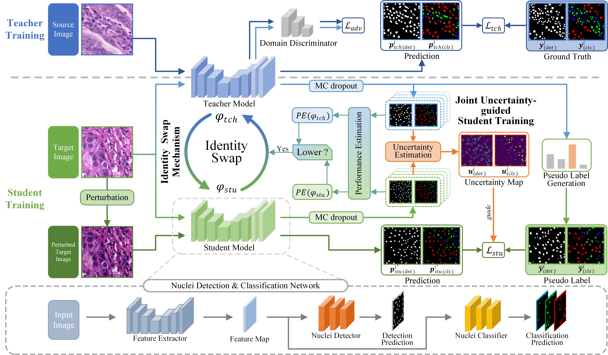

# Collaborative Teacher-Student (CTS) framework
This is the implementation of our paper:
**Enhancing Collaboration between Teacher and Student for Effective Cross-Domain Nuclei Detection and Classification**

[[Paper](https://doi.org/10.1016/j.bspc.2025.107763)]



Dataset preparation:
Please refer to [MCSpatNet](https://github.com/topoxlab/mcspatnet)

Configuration:
Please refer to `options.py`

Model training:
```aiignore
python 01_train_collaborative_teacher.py
```

Model evaluation:
```aiignore
python 02_eval_collaborative_teacher.py
```

We thank the project [MCSpatNet](https://github.com/topoxlab/mcspatnet) for their valuable contributions to this work.
